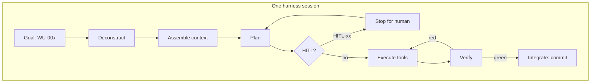
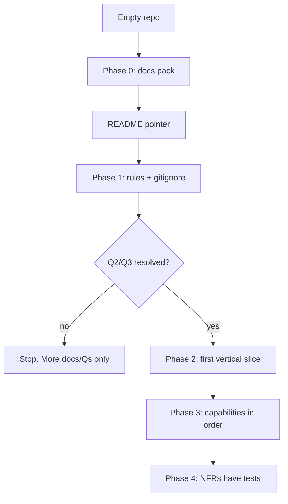

# Orchestration Architecture — from scratch

**Status:** 🟡 DRAFT  
**Version:** v0.1  
**Last updated:** 2026-09-08  
**Canonical location:** `docs/ORCHESTRATION.md`  
**Owns:** control loop, context assembly, rules, tools, HITL, bootstrap sequence  
**Does not own:** product stories (PRD), in/out list (SCOPE), WU inventory (TECH-SPEC)

This document answers: **how do we stand up orchestration when the repo is empty, and how does a Cloud Agent run a harnessed session without becoming an unsupervised intern?**

---

## 1) Target runtime

| Role | Who | Notes |
|------|-----|--------|
| **Source of truth** | Git (`docs/` + later `.cursor/rules/`) | Not chat history |
| **Orchestrator** | Cursor Cloud Agent (this class of runtime) | May also be local Cursor Agent |
| **Supervisor** | Human (Persona Sam) | HITL gates |
| **Builder** | Human (Persona Alex) | Starts sessions, reviews PRs |
| **Tools** | First-party Cursor tools + allow-listed MCP | Q7 |

**Default topology (v0):** one agent, one repo, one WU, one PR branch.  
**Not v0:** multi-agent mesh, self-hosted worker pools, cross-repo orchestration (Q10).



---

## 2) The context loop (canonical)

Orchestration is a loop, not a prompt. Every session MUST follow these phases. Skipping Assemble or Verify is a process bug.

### 2.1 Deconstruct

- Restate the **goal** (output type + accomplishment), not the user’s process narrative.
- Identify entities, WU id, constraints, and success/failure examples.
- If no WU id is given, **do not start coding**. Map the request to a WU or propose a new WU in TECH-SPEC (HITL if it changes SCOPE).

### 2.2 Assemble

Pull only what the WU pins. Typical pack:

1. `docs/TECH-SPEC.md` (the WU)
2. `docs/SCOPE.md` (still allowed?)
3. `docs/PRD.md` (intent, if the WU touches a story)
4. File paths listed on the WU
5. Matching `.cursor/rules/` (always + glob)

Do not dump the whole repo into context “for luck.”

### 2.3 Reason & plan

- Confirm dependencies are green.
- List steps that match the WU; refuse extra steps.
- If a `[DRAFT — resolve]` sits on the critical path: record assumption; do not lock.

### 2.4 Execute

- Invoke tools (edit, test, browse as required by the WU).
- Stay inside **Files to touch**.
- Honor **Don’t**.

### 2.5 Integrate & iterate

- Run **Verify**.
- If green: commit with `WU-xxx` in the message; stop or take the next WU only if the session prompt allowed a sequence.
- If red: iterate **inside** the WU.
- Update knowledge: if the spec was wrong, patch the spec in the same PR (contract change) rather than hiding the drift.

---

## 3) Orchestration architecture (layers from scratch)

Build **bottom-up**. Do not start with a custom orchestrator framework. Git + Markdown + Cursor rules *are* the v0 orchestrator.

```text
┌─────────────────────────────────────────────┐
│  A. Human interface (IDE, Cloud dashboard)  │
├─────────────────────────────────────────────┤
│  B. Session policy (prompt + WU + HITL)     │
├─────────────────────────────────────────────┤
│  C. Context engine (pins, rules, retrieval) │
├─────────────────────────────────────────────┤
│  D. Reasoning (plan vs blocked)             │
├─────────────────────────────────────────────┤
│  E. Execution (tools, MCP allow-list)       │
├─────────────────────────────────────────────┤
│  F. Governance (rules, audit, approvals)    │
├─────────────────────────────────────────────┤
│  G. Store (git, artifacts, later DB)        │
└─────────────────────────────────────────────┘
```

| Layer | v0 implementation | Later |
|-------|-------------------|--------|
| A | Cursor Cloud Agent UI / PR | Custom control plane (Q2) |
| B | PLAYBOOK session prompt + WU fields | Structured task objects in a DB |
| C | `@file` pins + rules globs | RAG over company docs |
| D | Model planning against the WU | Explicit planner with machine-readable plan JSON |
| E | Built-in tools | MCP: GitHub read, browsers, etc. (Q7) |
| F | Docs + HITL list + PR review | Signed audit log, RBAC |
| G | GitHub | Product database (Q4) |

**Principle:** software orchestration (Airflow-style DAGs, queues) is **out of scope** until a CAP says we have async jobs. Do not add Kafka “for architecture.”

---

## 4) Rule hierarchy (governance)

When Phase 1 lands, rules live at:

```text
.cursor/rules/
├── always/            # every session
├── auto-attached/     # globs
├── agent-requested/   # situational
└── manual/            # only when @mentioned
```

**Precedence on conflict:** manual `@rule` > auto-attached glob > always. Agent-requested must not override explicit human intent.

### 4.1 Always (minimum viable governance)

Draft contents (implement in WU-003):

- Never commit secrets or real PII
- Implement only the named WU; do not expand SCOPE
- Do not silently lock `[DRAFT — resolve]`
- Prefer links over duplicating PRD/SPEC
- Verify before claiming done

### 4.2 Auto-attached (later, by glob)

- `docs/**/*.md` — one fact one home; status banners
- `src/api/**` — envelope + Zod (when that tree exists)
- `src/components/**` — WCAG AA, no `any`

### 4.3 Agent-requested

- Performance (profile first)
- Security hardening (beyond always)
- Legacy refactors

### 4.4 Manual

- Migrations
- “Dangerous” one-off constraints (`@freeze-public-api`)

Rule craft: see user-facing RULES methodology — one topic per file, do/don’t, ✅/❌ examples. Do not paste this entire document into a rule.

---

## 5) Tool & MCP map

### 5.1 In-policy by default (this Cloud Agent class)

| Tool type | Allowed | Notes |
|-----------|---------|--------|
| Read/search/edit workspace files | yes | Stay in WU file list |
| Shell for Verify | yes | No destructive `rm -rf` outside task |
| Git commit/push on the working branch | yes | After Verify for code WUs |
| ManagePullRequest | yes | Docs/code PRs |
| MCP `cursor-cloud-*` diagnostics | yes | This runtime |
| Browser verification | only if a UI WU says so | Project UI rule |

### 5.2 Out of policy until Q7 / HITL

- Sending messages to Slack/email on behalf of the org
- Production deploys
- Purchasing cloud resources
- Scraping arbitrary third-party sites for “research” that is not in the WU
- Using forge CLIs to *create* PRs when ManagePullRequest exists (follow Cloud Agent git policy)

### 5.3 Tool policy invariant

Every tool call SHOULD be explainable as **advancing the current WU’s Verify**. If it cannot, skip it.

---

## 6) Human-in-the-loop gates

The agent MUST stop, write options, and wait when it hits a gate. “Waiting” in Cloud Agent terms = record in the PR/doc and do not apply the change.

| ID | Gate | Examples | Agent may |
|----|------|----------|-----------|
| **HITL-01** | Scope expansion | New user-facing feature not in SCOPE in-list | Propose SCOPE patch; not implement |
| **HITL-02** | Authz / trust model | Who can delete runs; public vs private | Document options |
| **HITL-03** | Secrets & credentials | New env vars, key rotation, `.env` contents | Use placeholders only |
| **HITL-04** | Destructive data | Drop table, hard-delete users, rewind git on `main` | Stop |
| **HITL-05** | Dependency / license | Adding a GPL or unknown package | List alternatives |
| **HITL-06** | Locking a DRAFT section | Promoting Q-id to Locked | Ask supervisor |
| **HITL-07** | External comms | Posting to issues/Slack “as the team” | Only if the user explicitly asked |

**Auto-allowed (not HITL):** typo fixes in docs; implementing a specified WU; running Verify; creating a feature branch matching repo policy.

Q8 may add gates. Until then, this table is the default.

---

## 7) Session types (orchestration modes)

| Mode | Prompt shape | Tools | Stop |
|------|--------------|-------|------|
| **Ask / clarify** | Fill Q-ids; no app code | Read-only | PRD/SCOPE patch proposal |
| **Spec edit** | Add CAP/WU using PLAYBOOK anatomy | Edit `docs/` | PLAYBOOK checklists |
| **Implement WU** | PLAYBOOK §6 start prompt | Edit + Verify | Verify green + Don’t-list |
| **Review** | Diff vs WU | Read | Checklist, no drive-by refactors |

Do not mix “rewrite the architecture” and “implement WU-007” in one session.

---

## 8) Bootstrap sequence — empty repo to harness

Follow in order. Each step is a WU (see TECH-SPEC). This is the **from-scratch** path.



### Step-by-step (operator view)

1. **Create the pack** (`docs/` as in TECH-SPEC §5.1).  
   Verify: files exist; PLAYBOOK §2 covered.
2. **Declare conflict rule and ID grammar.**  
   Already in SCOPE + TECH-SPEC.
3. **Name HITL gates** (this file §6).
4. **Add always rules** (WU-003): secrets, WU discipline, no silent locks.
5. **Add `.gitignore`** (WU-004).
6. **Optional:** markdown lint in CI (Q6).
7. **Do not** `create-next-app` / `cargo init` until CAP-004 exists.
8. **First code session:** pin docs + WU; implement; Verify; PR cites WU.
9. **Checkpoint:** tag or commit message `checkpoint: phase-0-docs` / `checkpoint: phase-1-rules`.
10. **Rollback:** `git revert` the WU commit; do not rewrite `main` history.

### Environment bootstrap (Cloud Agent VM)

If the machine is unfinished (deps installing):

- Read-only doc work: proceed.
- Verify that needs Node/Python: wait for environment setup or install **only what the WU names**.
- Do not kill setup processes.

---

## 9) Multi-step “pipeline” without a pipeline product

Until we have real ETL/jobs, **the WU graph is the DAG**.

```text
WU-000 → WU-001 → WU-002 → WU-003 → WU-004
                              ↘
                               WU-005 (blocked)
```

Rules:

- Fan-out is allowed when dependencies are green.
- No hidden parallel writes to the same file in two WUs.
- Promotion of DRAFT → Locked is a HITL node, not an agent side effect.

When we eventually need batch/stream jobs, specify them as a new CAP (queues, retries, idempotency) — do not sneak them into orchestration “because architecture diagrams look better.”

---

## 10) Checkpoints, rollback, and audit

| Mechanism | v0 |
|-----------|----|
| Checkpoint | git commit per green WU |
| Rollback | `git revert` / discard branch |
| Audit | PR + commit messages MUST contain `WU-xxx` |
| Transcripts | Cursor run history; retention = Q9 |

**Do not** implement a custom audit microservice in v0.

---

## 11) Failure orchestration

| Symptom | Orchestrator behavior |
|---------|----------------------|
| Ambiguous request | Map to WU or propose WU; no code |
| Conflict in docs | Conflict rule; patch; then continue |
| Verify fail loop | Cap retries `[assumption]` 3; then stop with evidence |
| Missing tools | State what could not be verified; do not fake green |
| HITL | Options table; blocked marker; stop |

---

## 12) Standing this up in another repo (copy recipe)

1. Copy `docs/PLAYBOOK.md` (craft is portable).
2. Rewrite PRD §1 and personas for that product.
3. Rewrite SCOPE in/out.
4. Keep TECH-SPEC anatomy; replace CAPs/WUs.
5. Keep this orchestration loop; replace tool map and HITL examples.
6. Add `.cursor/rules/always` from WU-003.
7. Run Flow A from the PRD.

Portable idea: **the harness is documentation + IDs + Verify**, not a particular framework.

---

## 13) Best-practice tips (orchestration-specific)

- **Orchestrate work, not vibes.** Vibes are allowed *inside* a WU’s constraints.
- **Pins beat memory.** If it is not pinned or in always-rules, assume the agent will forget.
- **Small DAG, strict edges.** Prefer 12 small WUs over 2 epics.
- **HITL is a feature.** Skipping it to “save time” is how trusted-employee dies.
- **One session, one mode** (clarify vs implement vs review).
- **Verify is part of orchestration**, not a courtesy.
- **Do not build an orchestration *product*** until Q2 says the product *is* a control plane.

---

## 14) Acceptance for this document

- [x] Loop named (deconstruct → assemble → plan → execute → integrate)
- [x] Layers mapped to v0 vs later
- [x] Rules hierarchy
- [x] Tool allow/deny
- [x] HITL table
- [x] From-scratch bootstrap
- [x] Portable copy recipe
- [ ] WU-003 implements always-rules on disk
- [ ] Q7/Q8 refine tool map and gates
