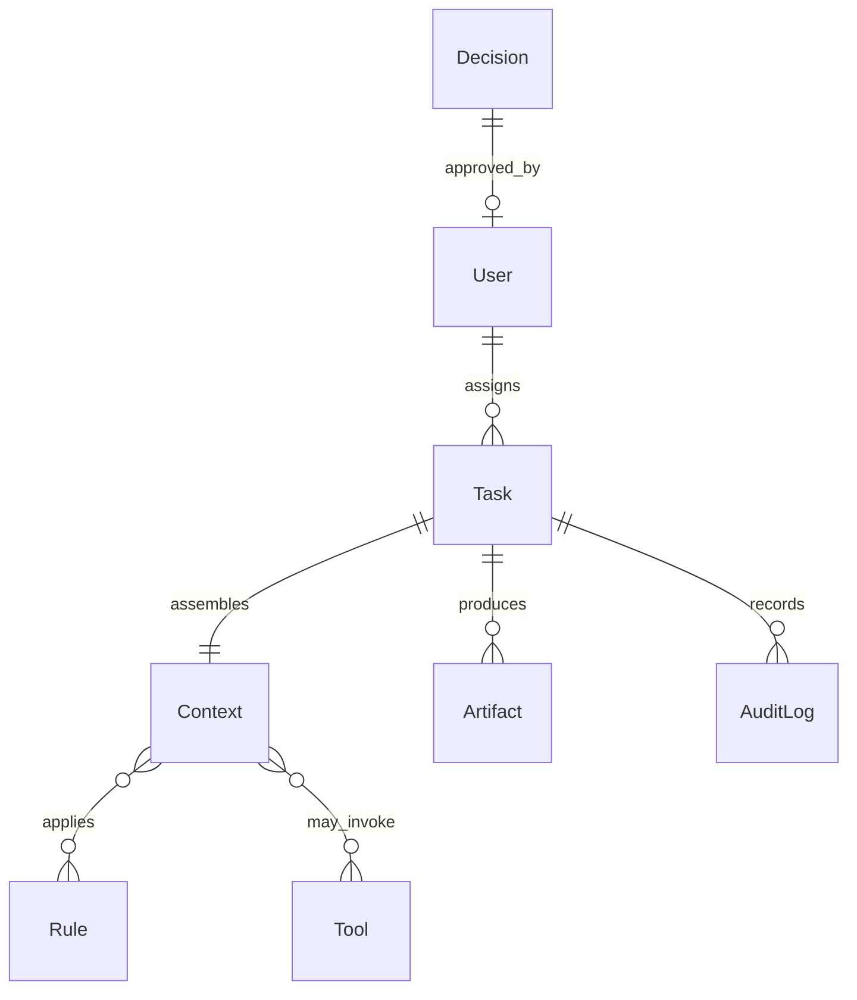
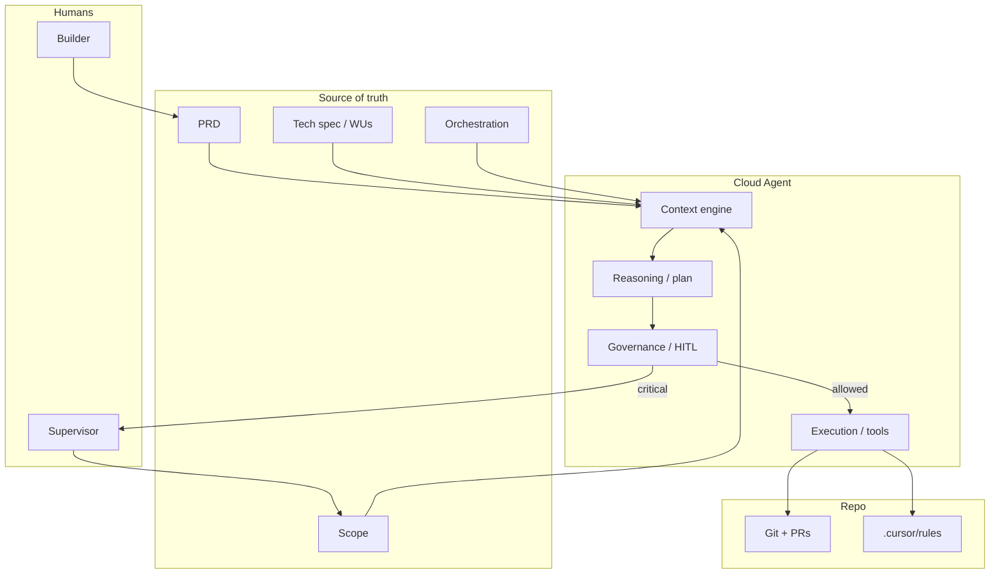

# Product Requirements Document (PRD)

**Product / Feature Name:** Cursor Cloud Agents — documentation-first workspace & implementation harness  
**Owner (PM):** `[DRAFT — resolve]`  
**Tech Lead:** `[DRAFT — resolve]`  
**Design Lead:** `[DRAFT — resolve]`  
**Stakeholders / Approvers:** `[DRAFT — resolve]`  
**Status:** 🟡 DRAFT  
**Version:** v0.1 Draft  
**Last Updated:** 2026-09-08  
**Canonical Location:** `docs/PRD.md`

> **Harness note:** Safe to implement documentation and orchestration bootstrap (WU-000–WU-004). Application runtime work waits on Q1–Q8 where marked.

---

## 1) Executive Summary (What & Why)

### Context & Background

This repository (`Cursor-` / **Cursor Cloud Agents**) starts nearly empty. The immediate product is not a random web app: it is an **AI-enabled development workspace** that can operate as a *trusted AI employee* — high flexibility, explicit context, rule-based governance, and human oversight.

The first milestone is **documentation-as-harness**: a PRD, scope, tech spec, and orchestration architecture that later coding sessions can execute step by step.

### Problem (1–3 sentences)

Teams can prompt an agent to “build the thing,” but without a canonical spec the agent invents scope, stack, and success criteria. That produces drift, unreviewable diffs, and systems nobody can govern. Humans also lack a shared language for what the agent is allowed to do.

### Solution (2–3 sentences)

We maintain one documentation pack that states intent (PRD), boundaries (SCOPE), mechanism (TECH-SPEC), and runtime control loop (ORCHESTRATION). Agents implement **one verified work unit at a time**. Critical decisions stay human; everything consequential is auditable.

### Primary Value Propositions (3–5)

- **Single source of truth** — intent, boundaries, and contracts are written down before code multiplies
- **Harnessed vibe-coding** — speed of generation with stop-conditions and verify hooks
- **Trusted-employee posture** — rules, least privilege, HITL, audit trail
- **From-scratch repeatability** — a blank repo can be brought up by following ORCHESTRATION
- **Transparent unknowns** — `[DRAFT — resolve]` beats silent wrong defaults

### Strategic Alignment

Positions Cursor as a **high-flexibility personal AI workspace** that can grow toward enterprise governance without becoming a closed, low-flexibility tool. Documentation-first delivery is the on-ramp to that trust model.

---

## 2) Scope Definition (Boundaries)

See **[SCOPE.md](./SCOPE.md)** for the authoritative in/out list and phase gates.

**This PRD’s milestone (MLS):** publish a complete DRAFT pack that an agent can use as a harness; do not ship an application UI in this milestone.

---

## 3) Goals, Success, and Constraints (Outcome-first)

### 3.1 One-Line Project Framing

```text
Make me a documentation-first AI workspace (Cursor Cloud Agents)
for builders and the agents that implement for them
that helps them ship the right system without silent scope invention
by doing PRD + scope + tech spec + orchestration as an executable harness
```

### 3.2 Primary Goal (Goal, not process)

```text
[Primary Goal]: I need a DRAFT documentation pack that an agent can execute as a step-by-step harness

[Context]: This is for Cursor Cloud Agents / trusted-AI-employee work, where governance and clarity matter more than generating files quickly

[Examples & Performance]: Success means a new session can implement WU-001 with only these docs pinned and a Verify command; failure is a novel-length PRD with no work units

[Constraints]: Focus on completeness of skeleton + honest unknowns; avoid fake precision and premature application code

[Outcome]: The reader (human or agent) should know what to build next, what not to build, and how to check that a slice is done
```

### 3.3 Definition of Success (High-level)

- **Business success:** Stakeholders can approve direction from this pack without a meeting transcript. `[assumption]`
- **User success:** A builder can start a coding session with “implement WU-00x” and get a bounded, verifiable change.
- **Technical/operational success:** Every required DRAFT section from `PLAYBOOK.md` §2 exists. Open questions are numbered. Work units have Verify hooks.

### 3.4 Hard Constraints (Non-negotiables)

- **Time:** This milestone is documentation-only (plus README pointer). `[assumption]`
- **Budget / resourcing:** Single-repo; no extra services required to *read* the pack.
- **Compliance / privacy:** Never commit secrets, tokens, or personal data into docs or examples. Use placeholders like `$CURSOR_API_KEY`.
- **Compatibility / platforms:** Docs are GitHub-flavored Markdown; diagrams are Mermaid (renders on GitHub).
- **Style / UX / accessibility:** Future UI MUST target **WCAG 2.1 AA**. Docs SHOULD be readable in a 80-character terminal preview (tables may wrap).
- **Language:** Product docs in English. `[assumption]` — Q15 if Slovenian/bilingual is required.

---

## 4) Target Market & User Analysis

### 4.1 Ideal Customer Profile (ICP)

- **Company characteristics:** Small-to-medium product teams adopting AI coding; later, enterprises that need auditability. `[DRAFT — resolve]` geography and industry.
- **Technology profile:** GitHub, Cursor, Markdown-in-repo, optional MCP tools; mixed TypeScript/Python later. `[assumption]`
- **Business context:** Pain = agent output that cannot be reviewed against a spec; workaround = giant chat threads.
- **ICP success criteria:** Time-to-first-verified-slice measured in one session, not one quarter.

### 4.2 Personas (2–4 primary)

#### Persona A — “Alex” the Builder (primary)

- **Role:** IC engineer / technical founder using Cursor daily
- **Goals:** Ship slices fast without rewriting architecture every session
- **Frustrations:** Agents that change unrelated files; undocumented decisions
- **Environment:** Cursor IDE or Cloud Agent; GitHub PRs
- **Success:** “Implement WU-007” produces a PR that matches the spec’s Verify

#### Persona B — “Sam” the Supervisor (governance)

- **Role:** Tech lead / EM
- **Goals:** Standards, security, reviewability
- **Frustrations:** Shadow specs in Slack; untestable “AI did it”
- **Environment:** GitHub review, rules in `.cursor/rules/`
- **Success:** Can see which WU a PR implements and which questions remain open

#### Persona C — “Riley” the Cloud Agent (executor)

- **Role:** Autonomous coding agent in this repo
- **Goals:** Complete one WU, verify, stop
- **Frustrations:** Ambiguous “improve the API”; missing file paths; no Verify
- **Environment:** Cloud VM, tools, MCP; no user in the loop until HITL gates
- **Success:** Zero silent inventions on `[DRAFT — resolve]` critical path

#### Persona D — “Jordan” the PM `[optional in v0]`

- **Role:** Owns intent and priority
- **Goals:** Problem/solution stay true
- **Success:** PRD §1 and §5 still match what shipped

---

## 5) User Stories, Flows, and Acceptance Criteria

### 5.1 User Stories (MANDATORY format)

- **Story 1:** As a **builder**, I want **a single PRD I can pin**, so that **the agent shares my definition of done**.
- **Story 2:** As a **builder**, I want **work units with Verify commands**, so that **I know when to stop the session**.
- **Story 3:** As a **supervisor**, I want **explicit out-of-scope and a decision log**, so that **PRs cannot quietly expand the product**.
- **Story 4:** As a **supervisor**, I want **HITL gates named in orchestration**, so that **critical decisions are not auto-applied**.
- **Story 5:** As a **cloud agent**, I want **file paths, Don’t-lists, and contracts**, so that **I do not invent structure**.
- **Story 6:** As a **cloud agent**, I want **numbered open questions**, so that **I can record assumptions instead of locking fake decisions**.
- **Story 7:** As a **builder**, I want **an orchestration bootstrap from an empty repo**, so that **I can recreate the harness elsewhere**.

### 5.2 Critical User Flows (3–5 journeys)

#### Flow A — Start a harnessed implementation session

- **Steps:**
  1. Open `docs/README.md` and pin the four product docs.
  2. Pick the next WU whose dependencies are green.
  3. Prompt: implement only that WU; run Verify; stop.
  4. Review diff against the WU Don’t-list.
- **Success scenario:** Verify is green; commit message cites `WU-xxx`.
- **Edge cases:**
  - Missing pin file → agent stops and lists missing paths
  - `[DRAFT — resolve]` on critical path → agent writes assumption, does not pretend Locked
  - Verify fails → agent stays inside the WU; no bonus refactors
- **Acceptance:**
  - Given WU-001 is next, When the session runs, Then no files outside the WU file list are modified

#### Flow B — Promote a DRAFT section to Locked

- **Steps:**
  1. Resolve blocking questions or accept an `[assumption]`.
  2. Human reviews the section.
  3. Mark section ✅ Locked; note in SCOPE decision log.
- **Edge cases:** Partial lock (API shape locked, SLO still DRAFT).
- **Acceptance:** Banner at top of the doc lists which WUs are now unblocked.

#### Flow C — Change scope without breaking the harness

- **Steps:**
  1. Propose change in SCOPE (in/out + decision log).
  2. Patch PRD stories if intent changed.
  3. Add/split WUs in TECH-SPEC; never silently reuse IDs.
- **Edge cases:** Feature request that is Out of scope → add to Future, do not implement.
- **Acceptance:** Given a rejected idea, When a later session starts, Then ORCHESTRATION/SCOPE still forbid it.

#### Flow D — Human-in-the-loop on a critical decision

- **Steps:**
  1. Agent reaches a HITL gate (see ORCHESTRATION).
  2. Agent writes the options, criteria, and recommendation in the PR or doc.
  3. Human approves; agent continues the next WU.
- **Edge cases:** Timeout / no human → agent MUST NOT apply the change; leave a blocked marker.
- **Acceptance:** No production secret, authz model, or destructive migration is applied without recorded approval.

#### Flow E — Recreate the workspace from scratch

- **Steps:** Follow ORCHESTRATION bootstrap (empty repo → docs → rules → first WU).
- **Edge cases:** Tooling missing in the environment → bootstrap lists fallbacks (see ORCHESTRATION).
- **Acceptance:** A reader can complete bootstrap using only `ORCHESTRATION.md`.

---

## 6) Requirements (What must be built)

### 6.1 Feature Requirements (Core)

#### Feature: Documentation pack (this milestone)

- **Overview:** Canonical Markdown docs that define product, scope, spec, orchestration, and craft.
- **Priority:** Critical — nothing else is reviewable without this
- **Complexity:** Moderate (completeness and honesty, not code volume)
- **User value:** Unblocks all later slices; reduces agent drift

**Functional requirements:**

1. Pack exists under `docs/` with the files listed in `docs/README.md`
2. Root `README.md` points to the pack and states status DRAFT
3. Every MUST-HAVE section from `PLAYBOOK.md` §2 is present
4. Work units in the tech spec are ordered and verifiable

**Edge cases:**

- GitHub Mermaid render failure → diagrams also described in bullets
- Future i18n → not in this milestone

**Acceptance criteria:**

- [x] `docs/PLAYBOOK.md` defines must-haves, topics, anatomy, practices
- [x] `docs/PRD.md` (this file) uses the canonical PRD shape
- [x] `docs/SCOPE.md` has in/out, phases, decision log
- [x] `docs/TECH-SPEC.md` has architecture + WUs + Verify
- [x] `docs/ORCHESTRATION.md` has from-scratch bootstrap
- [ ] Q1–Q8 answered or explicitly assumed before runtime WUs

**Design artifacts:** N/A (no UI this milestone)

---

#### Feature: Vibe-coding harness (spec-driven)

- **Overview:** Work units as the unit of execution; pin lists; Don’t-lists; Verify hooks.
- **Priority:** Critical
- **Complexity:** Moderate
- **User value:** Makes “vibe coding” reviewable

**Functional requirements:**

1. Each WU names files, dependencies, acceptance, verify
2. Agent instructions live in `docs/README.md` and PLAYBOOK §6
3. IDs never reused

**Edge cases:** Split WU → new ID suffix (`WU-014a`), old ID remains historical

**Acceptance criteria:**

- [x] WU anatomy documented in PLAYBOOK §4.3
- [x] At least WU-000–WU-004 specified in TECH-SPEC
- [ ] First code WU executed in a later milestone

---

#### Feature: Trusted-employee governance (directional)

- **Overview:** Rules hierarchy, HITL, audit, least privilege — specified now, implemented in later WUs.
- **Priority:** High (specify now; implement later)
- **Complexity:** Complex
- **User value:** Without this, Cloud Agents cannot be trusted in org contexts

**Functional requirements:**

1. ORCHESTRATION names rule layers and HITL gates
2. PRD forbids secrets in git
3. Future `.cursor/rules/` generated from locked decisions (out of *code* scope this milestone; in *spec* scope)

**Acceptance criteria:**

- [x] HITL gates listed in ORCHESTRATION
- [ ] `.cursor/rules/` bootstrap WU completed (see TECH-SPEC WU-003)

---

### 6.2 Non-Functional Requirements (NFRs)

- **Performance:** Interactive agent operations SHOULD target < 200ms for *local* context assembly once implemented `[DRAFT — resolve]` measurement method. Docs themselves have no runtime SLO.
- **Security:** OWASP-minded; no secrets in repo; future APIs validate input; authz least privilege. Audit log required for consequential agent actions (specified in ORCHESTRATION).
- **Reliability:** Docs are static files; availability = git host. Future runtime uptime `[DRAFT — resolve]` (placeholder 99.9% is **not** locked).
- **Accessibility & usability:** Future UI WCAG 2.1 AA; docs use semantic headings and tables.
- **Maintainability:** One fact, one home (PLAYBOOK §5.2). Markdown only for this milestone.

### 6.3 Dependencies & Integrations

- **External services:** GitHub; Cursor Cloud Agents runtime; later model providers `[DRAFT — resolve]`
- **Internal systems:** This git repository
- **Third-party libraries:** None for this milestone
- **Integration points:** MCP tools (see ORCHESTRATION tool map); GitHub PRs

---

## 7) Data, Domain, and Terminology

### 7.1 Glossary & Definitions

- **Workspace:** This repository plus the Cursor rules/context that govern agent behavior.
- **Artifact:** A durable output (doc, code, PR, log) produced by a work unit.
- **Collaborator:** Human with write or review rights; not the agent.
- **Subscription Tier:** `[DRAFT — resolve]` — not used in v0; do not implement billing.
- **DRAFT:** Complete skeleton with honest unknowns; not blank, not locked.
- **Locked:** Section approved enough to implement against without re-litigating intent.
- **Harness:** The combination of spec work units + Verify hooks + pin lists + stop rules.
- **Work unit (WU):** Smallest verifiable slice of change.
- **HITL:** Human-in-the-loop gate; agent must stop and record options.
- **Context pack:** The pinned files for a session.
- **Trusted AI employee:** Agent with verified skillset, access control, audit, and human supervision.
- **Vibe coding:** High-speed generation **inside** harness constraints (not unconstrained improvisation).
- **Orchestration:** How goals are decomposed, context assembled, tools invoked, and results integrated.
- **Rule:** Persistent instruction in `.cursor/rules/` with a defined trigger (always / glob / requested / manual).

### 7.2 Domain Model (DRAFT)

#### Core entities

- **Entity: User**
  - **Properties:** `id`, `role` (builder | supervisor | pm), `permissions`
  - **Relationships:** creates Tasks; approves Decisions
- **Entity: Task / WorkUnit**
  - **Properties:** `id` (WU-xxx), `status`, `dependsOn[]`, `verify`
  - **Relationships:** belongs to Capability; produces Artifacts
- **Entity: Context**
  - **Properties:** pins, rules, tools, memory
  - **Relationships:** assembled per Task
- **Entity: Rule**
  - **Properties:** `id`, `scope`, `category`, `content`, `version`
- **Entity: Decision**
  - **Properties:** `id`, `options`, `criteria`, `authority` (human | agent)
- **Entity: AuditLog**
  - **Properties:** `timestamp`, `action`, `actor`, `result`



---

## 8) Architecture, Tech Stack, and Interfaces

Authoritative detail: **[TECH-SPEC.md](./TECH-SPEC.md)** and **[ORCHESTRATION.md](./ORCHESTRATION.md)**.

### 8.1 System Architecture (High-level)



### 8.2 Technology Stack (Decisions & Rationale)

| Layer | Choice | Status | Rationale |
|-------|--------|--------|-----------|
| Docs | Markdown + Mermaid | ✅ Locked | Git-native, agent-readable |
| App framework | `[DRAFT — resolve]` Q3 | 🟡 | Do not scaffold until Q3 |
| Language | `[DRAFT — resolve]` Q3 | 🟡 | Default-if-we-must: TypeScript strict |
| Database | `[DRAFT — resolve]` Q4 | 🟡 | None this milestone |
| Auth | `[DRAFT — resolve]` Q5 | 🟡 | None this milestone |
| Hosting | GitHub repo + Cursor Cloud | ✅ Locked for v0 docs | Matches this runtime |
| CI | `[DRAFT — resolve]` Q6 | 🟡 | Optional markdown lint later |

### 8.3 API Design

N/A this milestone. Future endpoints MUST be specified as contracts in TECH-SPEC before implementation (PLAYBOOK §4.2).

### 8.4 Database Schema

N/A this milestone. When needed: UUIDs, timestamps, indexes on FKs, soft delete when retention matters (see data skills defaults — apply only after Q4).

---

## 9) Codebase Structure & Components

See TECH-SPEC § Directory layout. Expected at end of **this** milestone:

```text
project-root/
├── README.md
└── docs/
    ├── README.md
    ├── PLAYBOOK.md
    ├── PRD.md
    ├── SCOPE.md
    ├── TECH-SPEC.md
    └── ORCHESTRATION.md
```

---

## 10) Quality Assurance & Testing Strategy

### 10.1 Testing Approach

- **This milestone:** Human review against PLAYBOOK checklists (§5.9). Optional later: markdown lint, link check.
- **Later code milestones:** Every WU ships with its Verify (unit/integration/UI as specified). UI changes require browser (or substitute) verification per project rules.
- **UAT:** Supervisor walks Flow A–C using only the docs.

### 10.2 Quality Gates

- No secrets in git
- No WU without Verify
- No feature in code that is Out of scope
- WCAG AA named for any future UI WU
- Agent does not lock `[DRAFT — resolve]` silently

---

## 11) Delivery Plan

See SCOPE § Phases and TECH-SPEC § Work units. This PRD does not estimate calendar time.

- **Now:** Documentation pack (WU-000–WU-002)
- **Next:** Rules bootstrap + first vertical slice (WU-003+)
- **Later:** Runtime, UI, data, billing (explicitly out of current scope)

---

## 12) Metrics & KPIs (Measurement framework)

### 12.1 DRAFT metrics (documentation quality)

| KPI | Baseline | Target | Data source | Cadence | Trigger |
|-----|----------|--------|-------------|---------|---------|
| MUST-HAVE sections present | 0 | 100% of PLAYBOOK §2 | Review checklist | Per PR | Block merge of “spec complete” claims |
| Open questions numbered | n/a | All unknowns are Qn | PRD §13.3 | Per change | New TBD without Q-id |
| WUs with Verify | 0 | 100% of specified WUs | TECH-SPEC | Per WU add | New WU without Verify |
| Agent silent inventions | unknown | 0 on critical path | PR review | Per code PR | Spec patch caused by ambiguity |

Runtime product KPIs (adoption, latency, incidents) are **out of this milestone**; placeholders live in SCOPE → Future.

---

## 13) Risks, Assumptions, and Open Questions

### 13.1 Risks & Mitigations

- **Risk:** Spec rot (docs diverge from code)
  - Impact: High
  - Likelihood: High if we skip “one fact, one home”
  - Mitigation: Conflict rule; WU must update spec if contract changes
- **Risk:** Fake precision
  - Impact: Medium
  - Likelihood: High in enthusiastic DRAFTs
  - Mitigation: Status markers; Q-ids
- **Risk:** Harness too heavy; nobody uses it
  - Impact: High
  - Likelihood: Medium
  - Mitigation: MLS is docs + WU-001 runnable; keep WUs small
- **Risk:** Over-scoping into a full platform in the first code PR
  - Impact: High
  - Likelihood: High for agents
  - Mitigation: SCOPE Don’t-list; WU Don’t-list

### 13.2 Assumptions

- `[assumption]` English-only docs for v0
- `[assumption]` GitHub + Cursor Cloud is the runtime
- `[assumption]` TypeScript-first if Q3 is unanswered when code starts
- `[assumption]` No end-user billing in v0
- `[assumption]` Markdown/Mermaid is sufficient (no Notion as source of truth)

### 13.3 Open Questions (must be resolved)

- [ ] **Q1** Who is the named PM / Tech Lead / Design Lead for this repo?
- [ ] **Q2** Is the v1 *product* (a) the harness/docs themselves, (b) a Cloud Agent control plane, (c) a specific end-user app built *with* the harness, or (d) all three in sequence?
- [ ] **Q3** Application stack for the first code slice (Next.js App Router vs other; TS vs Python)?
- [ ] **Q4** Is a database required in the first vertical slice? Which engine?
- [ ] **Q5** Auth model for any future UI (none / magic link / OAuth / SSO)?
- [ ] **Q6** CI requirements (markdown lint, gitleaks, tests on PR)?
- [ ] **Q7** Which MCP servers are in-policy for agents in this repo?
- [ ] **Q8** What decisions are always HITL vs auto-allowed (beyond ORCHESTRATION defaults)?
- [ ] **Q9** Retention and PII policy for agent transcripts/logs?
- [ ] **Q10** Multi-agent orchestration (parent/subagents) in v1 or later?
- [ ] **Q11** Design system / Figma source for any UI?
- [ ] **Q12** Production hosting target and environments (dev/staging/prod)?
- [ ] **Q13** SLO/SLA owners and numbers (do not invent)?
- [ ] **Q14** License for this repository?
- [ ] **Q15** Bilingual docs (EN/SL) required?

---

## 14) Review, Approval, and Change Log

### 14.1 Review & Approval

- **Required approvers:** `[DRAFT — resolve]` Q1
- **Review process:** PR to `main`; 🟡 DRAFT may merge with open questions listed; ✅ Locked sections require a named human ack in the PR body.

### 14.2 Change Log

| Date | Version | Changes | Author |
|------|---------|---------|--------|
| 2026-09-08 | v0.1 Draft | Initial DRAFT PRD scaffold for Cursor Cloud Agents | Cloud Agent |

---

## Appendix A) PRD → Plan → Todo (for agents)

1. Read this PRD §1–§6 for intent.
2. Read SCOPE for boundaries.
3. Execute TECH-SPEC work units in order.
4. Use ORCHESTRATION for how to assemble context and when to stop for HITL.
5. If blocked by a Q-id, record assumption; do not promote to Locked.
