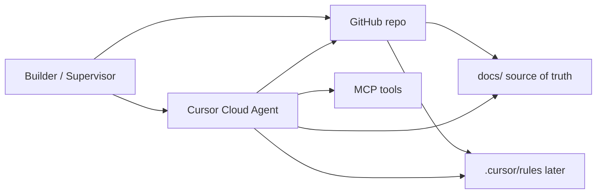

# Technical Specification (DRAFT) — Harness-ready

**Status:** 🟡 DRAFT — safe to implement WU-000–WU-004 as specified. Not safe to implement application runtime until PRD Q2–Q5 are resolved or assumed.  
**Version:** v0.1  
**Last updated:** 2026-09-08  
**Canonical location:** `docs/TECH-SPEC.md`  
**Pinned with:** `@docs/PRD.md` `@docs/SCOPE.md` `@docs/ORCHESTRATION.md` `@docs/PLAYBOOK.md`

This spec is written as a **vibe-coding harness**: capabilities → contracts → work units → Verify. Anatomy: `PLAYBOOK.md` §4.

---

## 1) Goal of the system (implementation view)

**Goal:** A git-native workspace where humans lock intent in docs and agents implement **one verified work unit at a time**, under orchestration rules.

**Success looks like:** `WU-00x` in a PR, Verify command in the PR body, no files outside the WU list.

**Failure looks like:** a framework scaffold, extra features, and a PR titled “initial app” with no WU id.

---

## 2) System context



**Trust boundary:** The agent may write to the working tree and open PRs. The agent may **not** apply HITL-gated decisions, commit secrets, or talk to out-of-policy MCP servers (Q7).

---

## 3) Layered architecture (from scratch)

Even before application code exists, **name the layers** so later files have a home. Do not invent a sixth layer without a decision-log row.

| Layer | Responsibility | May import | Must not |
|-------|----------------|------------|----------|
| **0. Source of truth** | PRD, scope, spec, playbook | nothing | runtime secrets |
| **1. Governance** | Rules, HITL, audit schema | Layer 0 | business features |
| **2. Context assembly** | Pin files, retrieve, pack | 0–1 | side effects |
| **3. Reasoning** | Plan WUs, detect blockers | 0–2 | mutate prod |
| **4. Execution** | Tools, patches, tests | 0–3 | skip Verify |
| **5. Integration** | git, PR, checkpoints | 0–4 | rewrite Locked intent |

Application features (when Q2/Q3 land) sit **behind** these layers as a *payload*, not a replacement for them.

Detailed runtime loop: **[ORCHESTRATION.md](./ORCHESTRATION.md)**.

---

## 4) Stack decisions

| Concern | Decision | Status |
|---------|----------|--------|
| Spec format | GFM Markdown + Mermaid | ✅ Locked |
| First milestone payload | Documentation pack only | ✅ Locked |
| App runtime | Per PRD Q3 | ⬜ default-if-we-must: TypeScript strict |
| Package manager | `[DRAFT — resolve]` | ⬜ default-if-we-must: `pnpm` if Node |
| Validation lib | `[DRAFT — resolve]` | ⬜ default-if-we-must: Zod |
| Test runner | `[DRAFT — resolve]` | ⬜ default-if-we-must: Vitest or pytest matching language |
| CSS / UI | Out of scope until a UI CAP is added | ✅ Locked out |

---

## 5) Directory layout (target)

### 5.1 After this documentation milestone (MUST)

```text
/
├── README.md
├── COMPANY.md
├── CLAUDE.md
├── DECISIONS.md
├── ACTIVITY.md
├── docs/
├── site/
├── inbox/
├── calls/
├── knowledge/
│   ├── INDEX.md
│   ├── _provisional.md
│   └── _graveyard.md
├── logs/
├── workspaces/
├── skills/
├── scripts/
├── hooks/
└── .cursor/rules/always/company-os.mdc
```

Company OS is in-scope item 9 (SCOPE). Product specs remain `docs/`. Writing tool remains `site/`.

### 5.2 After harness bootstrap (Phase 1 — WU-003)

Always-rule `company-os.mdc` is present. Additional always-rules (secrets, WU discipline) may still be added as WU-003.

### 5.3 After first vertical slice (Phase 2 — do not create until Q3)

**Do not** pre-create `src/` in this milestone. When Q3 is assumed, add a CAP with the real tree. Suggested *shape only* (not Locked):

```text
src/
  api/          # HTTP or tool handlers
  domain/       # invariants, no I/O
  lib/          # adapters
  components/   # UI only if CAP says so
```

---

## 6) Cross-cutting contracts

### 6.1 Response envelope (future APIs)

When APIs exist, they MUST use one envelope. Do not implement now.

```text
success: { ok: true, data: T }
error:   { ok: false, code: string, message: string, fields?: string[] }
```

`code` is machine-stable (`VALIDATION_ERROR`, `NOT_FOUND`, `HITL_REQUIRED`). `message` is human-safe (no secrets).

### 6.2 Audit event (future runtime)

MUST emit (when execution layer exists):

| Field | Notes |
|-------|--------|
| `timestamp` | ISO-8601 |
| `actor` | `user:<id>` or `agent:<runId>` |
| `wuId` | `WU-xxx` or `none` |
| `action` | e.g. `files.patch`, `decision.block` |
| `result` | `ok` / `error` / `blocked_hitl` |

### 6.3 ID grammar

| Kind | Pattern | Example |
|------|---------|---------|
| Question | `Q` + integer | `Q3` |
| Capability | `CAP-` + 3 digits | `CAP-001` |
| Work unit | `WU-` + 3 digits | `WU-003` |
| HITL gate | `HITL-` + 2 digits | `HITL-01` |

Never reuse. Splits append a letter (`WU-003a`).

---

## 7) Capabilities

### CAP-001: Documentation pack (source of truth)

**Goal:** I need a complete DRAFT pack that humans approve and agents execute.  
**Context:** Empty Cursor Cloud Agents repo; first readers are builders, supervisors, and cloud agents.  
**Success:** PLAYBOOK §2 checklist is fully covered. **Failure:** empty headings or a single undifferentiated blob.  
**Constraints:** Focus on honesty and harness anatomy. Avoid application scaffolding.  
**Pinned context:** `@docs/PLAYBOOK.md` `@docs/PRD.md` `@docs/SCOPE.md`

**Contracts**

- **Input:** Product intent (Cursor Cloud Agents / trusted employee / harness)
- **Output:** The six files under `docs/` plus root README pointer
- **Errors:** Missing must-have section = DRAFT not mergeable as “complete”

**Invariants**

- Always: status banners, Q-ids for unknowns, conflict rule
- Never: secrets, fake Locked SLOs, duplicate conflicting endpoint lists

**Examples**

- ✅ Good: PRD Story 5 names agent needs (paths, Don’t-list)
- ❌ Bad: “The system should be scalable and use best practices” with no WU

**Work units:** WU-000, WU-001, WU-002  
**Verify:** File existence + section presence (WU-001)  
**Done when:** Phase 0 exit in SCOPE is true

---

### CAP-002: Work-unit harness

**Goal:** I need work units that are small, pinned, and verifiable.  
**Success:** An agent can run a session on a single WU without asking where files live.  
**Constraints:** No god-WUs. Verify ≤ 3 commands.

**Contracts**

- Each WU includes the fields in PLAYBOOK §4.3
- PR body SHOULD cite `WU-xxx`

**Invariants**

- Always: Don’t-list
- Never: “also refactor unrelated”

**Work units:** WU-000 (defines the format by example), later code WUs  
**Verify:** Human/agent checklist in PLAYBOOK §5.10

---

### CAP-003: Governance bootstrap

**Goal:** I need a rules directory and HITL list so later code cannot ignore the spec.  
**Constraints:** Do not invent a 20-rule novel; start with security + “implement only the WU”.  
**Depends on:** CAP-001  
**Work units:** WU-003  
**Status:** Specified; implement in Phase 1

---

### CAP-004: First vertical slice (placeholder)

**Goal:** `[DRAFT — resolve Q2/Q3]` Prove the harness on one thin runtime path.  
**Do not start** until SCOPE Phase 2 entry is true.  
**When started:** add contracts, examples, WUs here *before* coding.

---

## 8) Work units (executable harness)

Legend: `docs` = this milestone; `phase1` = rules; `blocked` = waiting on Q-ids.

---

### WU-000 — Establish documentation map

| | |
|---|---|
| **Status** | specified for this PR (docs milestone) |
| **Goal** | Readers know the pack order and conflict rule |
| **Depends on** | none |
| **Pins** | `@docs/README.md` `@docs/PLAYBOOK.md` |
| **Files** | create `docs/README.md`, `docs/PLAYBOOK.md` |
| **Don’t** | add application code; add extra top-level folders |
| **Acceptance** | Given a new clone, When someone opens `docs/README.md`, Then they see the 0→4 reading order and harness steps |
| **Verify** | `test -f docs/README.md && test -f docs/PLAYBOOK.md` |
| **Rollback** | delete those files |

---

### WU-001 — Publish PRD, Scope, Tech spec, Orchestration DRAFTs

| | |
|---|---|
| **Goal** | All product docs exist with must-have sections |
| **Depends on** | WU-000 |
| **Pins** | `@docs/PLAYBOOK.md` |
| **Files** | create `docs/PRD.md` `docs/SCOPE.md` `docs/TECH-SPEC.md` `docs/ORCHESTRATION.md` |
| **Don’t** | scaffold `src/`; lock Q3 stack as if decided |
| **Acceptance** | PLAYBOOK §2.1–§2.4 sections are present (not empty headings) |
| **Verify** | `test -f docs/PRD.md && test -f docs/SCOPE.md && test -f docs/TECH-SPEC.md && test -f docs/ORCHESTRATION.md` |
| **Done when** | Open questions are numbered Q1+ |

---

### WU-002 — Point the root README at the pack

| | |
|---|---|
| **Goal** | Repo root is not a dead `# Cursor-` heading |
| **Depends on** | WU-001 |
| **Files** | edit `README.md` |
| **Don’t** | paste the entire PRD into README |
| **Acceptance** | README states DRAFT status, one-line framing, and links to `docs/` |
| **Verify** | `grep -q "docs/README.md" README.md` |

---

### WU-003 — Bootstrap `.cursor/rules/` (Phase 1 — not this PR unless included)

| | |
|---|---|
| **Status** | ⬜ specified; **out of this docs-only PR unless a follow-up commits it** |
| **Goal** | Always-on rules: no secrets; implement only the named WU; English; no silent Q-locks |
| **Depends on** | WU-002 |
| **Files** | create `.cursor/rules/always/*.mdc` (security, harness discipline) |
| **Don’t** | 50 overlapping rules; copy the entire PLAYBOOK into a rule |
| **Acceptance** | Given a session without extra prompts, When the agent implements a WU, Then it still refuses secrets-in-git |
| **Verify** | `test -d .cursor/rules/always && test -n "$(ls .cursor/rules/always)"` |

---

### WU-004 — Add a secrets-safe `.gitignore` (Phase 1)

| | |
|---|---|
| **Status** | ⬜ Phase 1 |
| **Goal** | `.env` and key material cannot be committed accidentally |
| **Depends on** | WU-002 |
| **Files** | create/edit `.gitignore` |
| **Don’t** | ignore `docs/` |
| **Acceptance** | `.env`, `*.pem`, `.cursor/*.key` ignored |
| **Verify** | `git check-ignore -q .env` |

---

### WU-005 — First runtime vertical slice

**Status:** 🚫 **blocked** on Q2, Q3 (and Q4/Q5 if the slice needs data/auth).

When unblocked, replace this stub with a full PLAYBOOK §4.2 capability + WUs. Until then, agents MUST NOT create `package.json` / `src/` “to get ready.”

---

## 9) Failure modes (specified, not improvised)

| Failure | Detection | Response |
|---------|-----------|----------|
| Spec conflict | Two docs disagree | Stop; apply conflict rule; patch the loser |
| Missing pin | File in WU pins not on disk | Stop; list missing paths |
| Verify red | Command nonzero | Stay in WU; no scope expansion |
| HITL gate | See ORCHESTRATION | Write options; do not apply |
| Secret in diff | `gitleaks` or review | Block merge; rotate if leaked |
| God-WU | >15 steps or >3 verify commands | Split before coding |

---

## 10) Security notes for this slice

- Docs may show **shapes** (`Authorization: Bearer $TOKEN`), never real credentials.
- Do not document exploit PoCs. Defensive guidance only.
- Future user input → schema validation (Zod or equivalent) before persistence.
- Least privilege: agent write access is the repo; not cloud billing, not arbitrary egress `[DRAFT — resolve Q7]`.

---

## 11) Test strategy mapped to WUs

| WU | Test seat |
|----|-----------|
| WU-000–002 | File/section existence; human PLAYBOOK §5.9 |
| WU-003 | Rule files exist; later: a prompt eval if we add one |
| WU-004 | `git check-ignore` |
| Future UI WUs | Browser (or substitute) per project UI rule; a11y checks named in the WU |
| Future API WUs | Contract tests for envelope + validation errors |

Coverage target for *code* (later): `[DRAFT — resolve]` — default-if-we-must 80% on new domain functions, not vanity 100% on glue.

---

## 12) Observability (when runtime exists)

MUST log: WU id, actor, action, duration_ms, result.  
MUST NOT log: raw tokens, request bodies with PII (Q9).  
Metrics placeholders (not Locked): silent-invention count, Verify pass rate, HITL wait count.

---

## 13) Context pin lists (copy into sessions)

**Docs-only session**

```text
@docs/README.md @docs/PLAYBOOK.md @docs/PRD.md @docs/SCOPE.md @docs/TECH-SPEC.md @docs/ORCHESTRATION.md
```

**Implement WU-00x**

```text
@docs/TECH-SPEC.md (the WU section) + every path listed in that WU’s Pins
```

**Do not pin** the entire historical chat. Pin files.

---

## 14) Definition of done — this spec revision

- [x] Layers named
- [x] Layout for Phase 0 named
- [x] CAP-001–003 described
- [x] WU-000–WU-005 listed (005 blocked)
- [x] Envelope + audit + ID grammar
- [ ] Q2/Q3 unblocks CAP-004
- [ ] WU-003/004 implemented on a Phase 1 PR
